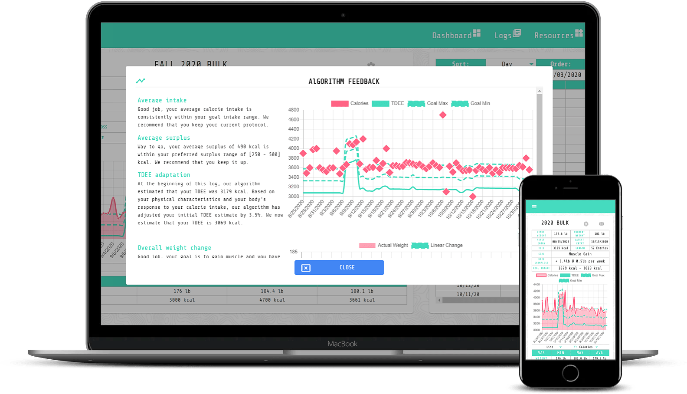
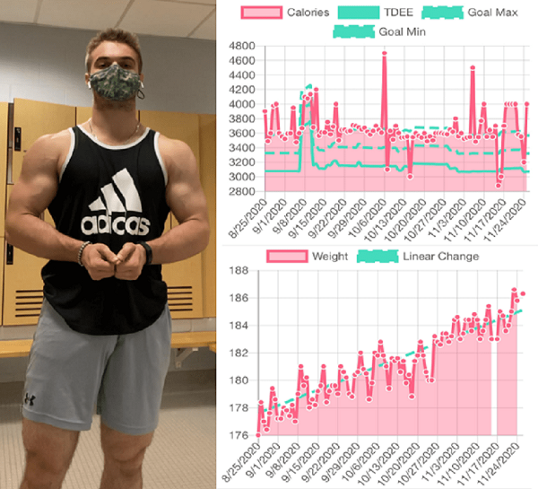
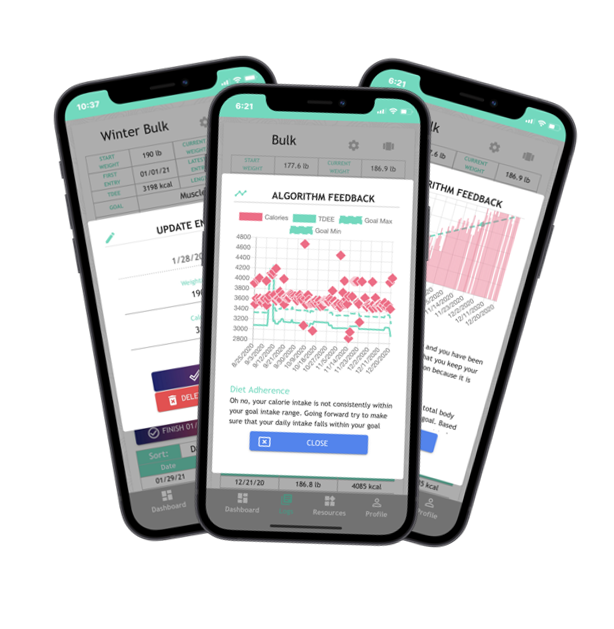
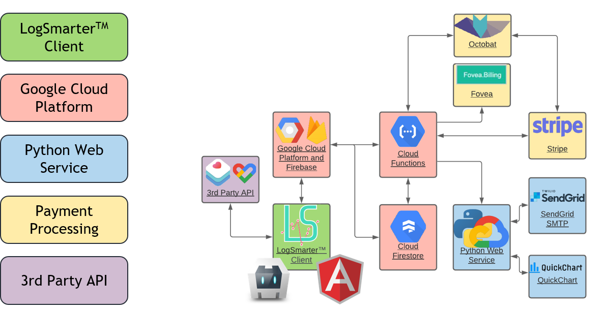
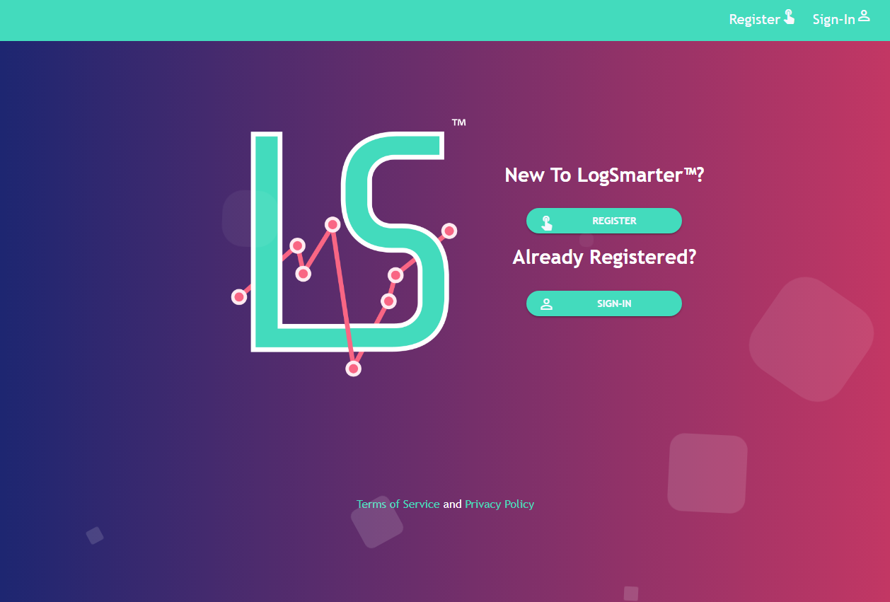
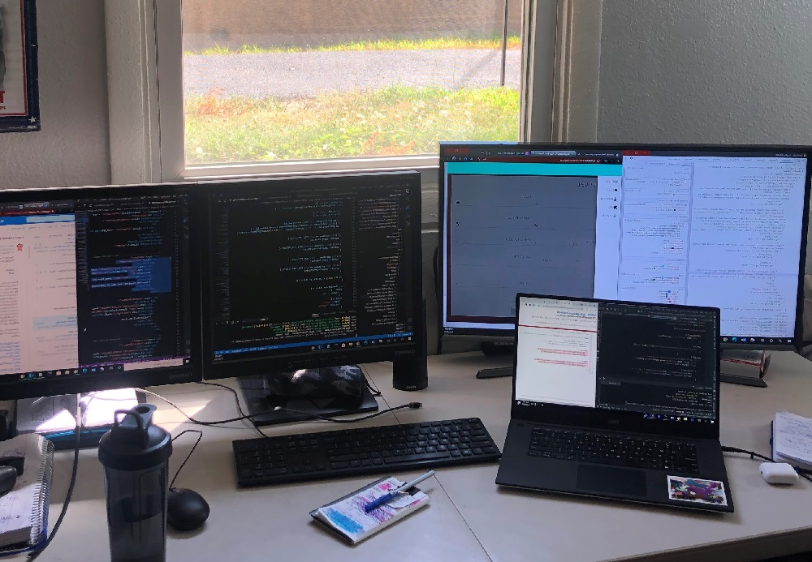
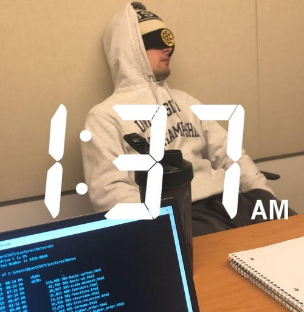

# LogSmarter - Machine Learning Nutrition Tracker



## Description

`LogSmarter`  LogSmarter™ is not just another calorie counter. It is an AI nutrition
coach that uses machine learning to help people reach and sustain their health goals.
You tell us your demographic information and whether you want to gain muscle or
lose fat. From there our proprietary machine learning algorithm will generate a goal
calorie intake that fits your individual needs. As you progress towards your goal of
gaining muscle or losing fat, your metabolism will change. Based on daily records of
your calorie intake and body weight, our algorithm will update your goal calorie
intake appropriately to make sure you are optimizing your nutrition. As our algorithm
learns more about you, it will provide feedback to make sure you are following the
latest evidence based nutrition recommendations



## Open Source Changes

The open source project has some minor changes to the paid application. The biggest is that the initial prediction from the machine learning model has been removed, the rest of the algorithm remains as it was,
but we have not yet released the code or documentation around that model. The only other large difference is that we've disabled payment processing and given everyone the highest level of permissions within the system as the default when they create their account. That way, anyone who sets up the project doesn't need to worry about subscription state.



## Architecture



## Technical Warning

The code in this project is far from perfect. Like I said above, I started writing the code with ZERO web dev experience and learned as I went. There was no real planning for the first year or so. The first lines of Angular I ever wrote are still in this codebase. The plan was just to work as hard as I can and I'll figure it out later. If I could do it again, maybe I would have planned things cleaner from a technical perspective, but depending on what the goal was, maybe I would have done it the same all over again. We were a cash flow positive business with more users than most college start ups will ever have. If you are looking for what cleaner code might have looked like within this project, take a look at a project I worked on that rips out all of the nutrition stuff from `LogSmarter` and cleans up the code to create an app skeleton with a working authentication system https://github.com/RyanLefebvre/FAngS

## Technologies Used

| Technology          | Version       |
| ------------------- | ------------- |
| Angular             | ^8.2           |
| Node                | 12.22.5       |
| Firebase Functions  | ^3.6.2        |

## Getting Started

The following guide walks you through setup for the web application. Getting the project set up is simple and will only take a few minutes. The mobile setup is more complex and I have not included it here, but if I get enough requests then I will. Reach out to me if you would be interested in that. Last thing before we start is that this guide assumes you have an understanding of git. Check out the [git documentation](https://git-scm.com/doc) if you don't.

1. The first thing to do is clone the project. I would recommend forking the project first, then cloning if you plan to use it as a base for your next project. 

```
    git clone https://github.com/RyanLefebvre/LogSmarter
```

2. Next you'll need to [download and install node](https://nodejs.org/en/download/). Try to match or exceed the version the project is currently using. To verify that you have successfully installed node, you can check the version from the command line. 

```
    node --version
```

3. The next step is to create a Firebase Project. Go to the [Firebase console](https://console.firebase.google.com/) and click on the `Add project` button.

4. Once your project is created, you will be redirected to that project's management console. You have some set up that needs to be taken care of. First, go to the `authentication` tab underneath build. You can see it on the sidenav on the left side of the window. Then click on the `Set up sign-in method` button. At a minimum, select the option called `Email/Password` and enable it.

5. Next is your database, go to the `Firestore Database` tab underneath build. You can see it on the sidenav on the left side of the window. Click on the `Create Database` button. 

6. Now that the database is created, we need to add the Users table. Click on start collection and create collections with the following names `Users`, `AutoGold`, `EmailFeedback`, `IAB`, `IAP`, `NutritionLogs`,`PromoCodes`, `Social`. It will force you to create a document within the collection but its okay to just use the auto-id button and delete the document after if you don't want the one junk document in your database. Depending on which parts of the codebase you choose to explore beyond this getting started guide, you may never touch some of these tables.


To set up the `Social` table, you will need to add a document called `social-dashboard` and add the following properties

```
    owners:[
                {
                    "id": "0000",
                    "displayName": "LogSmarter",
                    "themeColor": ""
                }
           ]
```

and

```
    owners:[
            {
                "type": "YOUTUBE",
                "title": "What is TDEE?",
                "data": "6Dniijit0d4",
                "ownerId": "0000"
            },
            {
                "type": "YOUTUBE",
                "title": "What is LogSmarter™?",
                "data": "DsgYFm-DABA",
                "ownerId": "0000"
            },
            {
                "type": "YOUTUBE",
                "title": "Importance of Maintenance",
                "data": "RlLP_EfbWZ8",
                "ownerId": "0000"
            },
            {
                "type": "YOUTUBE",
                "title": "How To Use LogSmarter™",
                "data": "ndhiL91lkUg",
                "ownerId": "0000"
            },
            {
                "type": "YOUTUBE",
                "title": "What Are Macros?",
                "data": "QN560FYJ6ro",
                "ownerId": "0000"
            },
            {
                "type": "YOUTUBE",
                "title": "Activity Level",
                "data": "Ll7o4BNC7zI",
                "ownerId": "0000"
            },
            {
                "type": "YOUTUBE",
                "title": "Tracking Calories",
                "data": "1XNRFVqF5rA",
                "ownerId": "0000"
            },
            {
                "type": "YOUTUBE",
                "title": "Tracking Weight",
                "data": "GpJ1uS-v-6U",
                "ownerId": "0000"
            }
        ]
```

7. Go back to the Project Overview by clicking on the house icon above the Build section on the sidenav. You have to add an app to the project to generate client secrets. Choose the web option. During this process you'll be given a Firebase Config object in JSON format. Save this as we will need it again later. It should look something like below.

```
    const firebaseConfig = {
            apiKey: "XXXXXXXXXXXXXXXXXXX",
            authDomain: "XXXXXXXXXXXXXXXXXXX",
            projectId: "XXXXXXXXXXXXXXXXXXX",
            storageBucket: "XXXXXXXXXXXXXXXXXXX",
            messagingSenderId: "XXXXXXXXXXXXXXXXXXX",
            appId: "XXXXXXXXXXXXXXXXXXX",
    };
```

8. Go back to the project you cloned in Step 1. Navigate to the app/web/src directory and create a subdirectroy called environments. In the environments subdirectory create a file called environment.ts. In this file create an object named environment that is exported. The object should have a key called `production` which is either true or false and one called `firebase`. The value of the firebase key in the environment object should be the contents of the firebase config object from step 7.

```
    cd LogSmarter/app/web/src
    mkdir environments
    cd environments
    touch environment.ts
```

So inside environment.ts you would have
    
```
    export const environment = {
    production: false,
    firebase: {
        apiKey: 'XXXXXXXXXXXXXXXXXXX',
        authDomain: 'XXXXXXXXXXXXXXXXXXX',
        projectId: 'XXXXXXXXXXXXXXXXXXX',
        storageBucket: 'XXXXXXXXXXXXXXXXXXX',
        messagingSenderId: 'XXXXXXXXXXXXXXXXXXX',
        appId: 'XXXXXXXXXXXXXXXXXXX',
      },
    };
```


9. Now install the projects frontend dependencies using NPM

```
    npm ci
```

10. Verify that the frontend unit tests work and show 100% testing coverage using the command below. The output from karma will show you the coverage in your terminal. You should also see a coverage directory that was generated inside the app directory. It contains an istanbul report with more information. If you open the index.html file inside the coverage directory in a browser you can see exactly which files are covered.

```
    npm run testWithCoverage
```

11. Verify that the frontend documentation works and show 100% coverage using the command below. You should see a documentation directory that was generated inside the app directory. If you open the index.html file inside the documentation directory in a browser you can access the projects documentation.

```
    npm run doc
```

12. Now that the frontend is good to go, you need to set up the firebase cloud functions for the project. This is most easily done using the firebase-cli. If you haven't already, install the cli which is part of the [firebase-tools package](https://www.npmjs.com/package/firebase-tools). Using the CLI, you will have to login, choose to use the project, then initialize cloud functions. When prompted, be sure to choose TypeScript as the functions language and be absolutely sure not to overwrite any existing files when it asks you. That will definitely break things if you start overwriting those files. If you aren't sure what your Project ID is, you can run the command `firebase projects:list` to see all your projects and find the one with the correct ID.

```
    cd LogSmarter/app/web/functions
    npm install -g firebase-tools
    firebase login
    firebase projects:list
    firebase use YOUR_PROJECT_ID
    firebase init functions
```

13.  Now install the projects cloud function dependencies using NPM

```
    cd LogSmarter/cloud-functions/functions
    npm ci
```

14.  For the cloud functions to work, they need to be deployed. Run the following command. It might take a minute, but your cloud functions will be ready to go.

```
    firebase deploy --only functions
```

15. Verify that the backend unit tests work and show 100% testing coverage using the command below. We had to use a different testing framework than the frontend because cloud functions don't like karma/jasmine :(

```
    npm run test
```

16. At this point the project should be all set up for local development. Navigate to the frontend portion of the project (i.e. the app directory) and use the npm start command to run the project locally. Once the build finishes you can access the project on [localhost:4200](http://localhost:4200/)



17. DISCLAIMER - This isn't a step thats necessary, but it is worth mentioning. For some reason, cloud functions won't always work the first time they are deployed and will make it look like there are cors errors. If you run into that issue, then you will need to go into the GCP project for your firebase project and assign the allUsers service account a role of Cloud Functions Invoker. A better explanation can be found [here](https://github.com/firebase/functions-samples/issues/395#issuecomment-605025572).

## Origin Story

`LogSmarter` used to be a pay to use web and mobile application with a few thousand users. The reason I've decided to open source it is because the team and I just don't have the bandwidth to maintain it any more. We've all moved on to bigger and better opportunities. My hope is that by open sourcing it, technical members of the community could spin up their own instances following our getting started guide and create their own personal 'servers' kind of like minecraft servers. That way the project lives on and spreads (like a disease). Although the payment processing system is disabled with a simple code change, all of that is still in the codebase and we have no problem with people enabling the payment processing to fund their servers or fund new features they wish to add. Basically do whatever you want and have fun, we don't care.

It's kind of nuts how far the project even went. I started working on it in 2019 when I had just finished my Sophomore year of college and I was living alone in Connecticut in a one bedroom apartment for my first internship. 



At the time I had ZERO web dev experience and believe it or not, the first lines of code I ever wrote in Angular are actually still in this project. All summer I crammed in development when I could while working a full time job. Eventually I had cobbled something usable together and I made a few reddit posts about it. To my surprise, hundreds of people signed up for my project that was just supposed to be a resume booster and everything exploded from there. https://www.reddit.com/r/nSuns/comments/cpytvh/tdee_estimation_web_app_logsmarter/

At that point I was really really motivated. When I got back to college, I slowly built a team of people I trusted and I traded balance in my lifestyle for an investment in my own human capital and the success of my business. I consistently woke up early, stayed up late and stayed in on the weekends so I could work on `LogSmarter` while maintaining my performance in my classes. Everything I did revolved around what I call the three Fs, Family, Fitness and Finance. If something I was doing didn’t seem like it was going to lead to a positive outcome for my family and friends, my physical fitness or the financial situation of myself and the people I love, I cut it out of my life. I vividly remember some of the worst moments, like staying up for 3 days in a row during finals my junior year so I could juggle working on `LogSmarter` and studying.



All in all, everything worked out pretty well, the team and I accomplished a lot and I would not be working on the things I am at the time of writing this if it weren't for what I learned building `LogSmarter`. I also won some competitions and awards which I am pretty proud of. I learned a ton, not just about software development, but finance, marketing, management, communication etc. We actually got a few offers to buy our codebase, but nothing ever panned out, so if you're interested in buying it, we may be interested in selling it. Contact Ryan.lefebvre04@gmail.com for more information.

